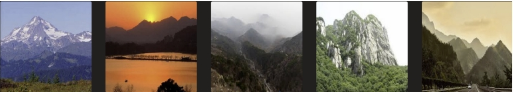
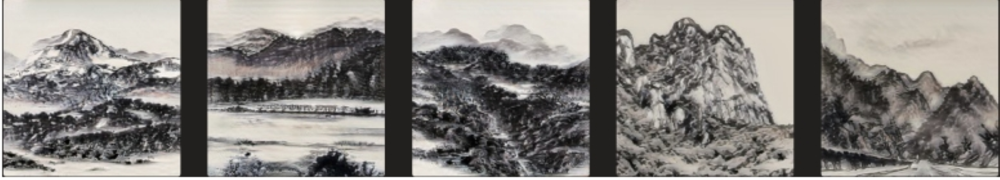
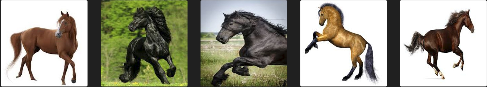
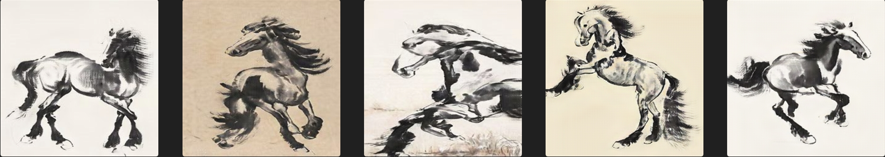
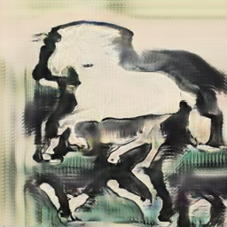
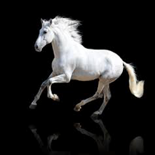

# README

This is the project for COSC_5470 at Georgetown University.

**Team member:** Zihang Zhu:zz451, Xingjian Qu:xq59

## 1. The model we use

- [pytorch-CycleGAN-and-pix2pix](https://github.com/junyanz/pytorch-CycleGAN-and-pix2pix):  https://github.com/junyanz/pytorch-CycleGAN-and-pix2pix

  

**Environmental setup:**

```xml
Model name: pytorch-CycleGAN-and-pix2pix
Model link: https://github.com/junyanz/pytorch-CycleGAN-and-pix2pix
OS and device: Windows11 + NVIDIA GPU
channels:
- pytorch
- defaults
dependencies:
- python=3.8
- pytorch=1.8.1 -- I downloaded Pytorch 1.13.0 including CUDA because the recommended version does not support CUDA
- scipy
- pip
- pip:
- dominate==2.6.0
- torchvision==0.9.1
- Pillow==8.0.1
- numpy==1.19.2
- visdom==0.1.8
- wandb==0.12.18

```

**Problems during configuring Environment:**

- Current pytorch version 1.8.1 doesn't support sm_86.
- Go for pytorch 1.9.1 with cuda --> 'torch.C' has no attribute 'cuda_setDevice'.
  - Still need higher version of pytorch.
- Go for pytorch 1.13.0 -- finally work, but a new problem :
  - UserWarning: Detected call of lr_scheduler.step() before opt imizer.step() . In PyTorch 1.1.0 and later, you should call them in the opposite order: optimizer.step() before lr_scheduler.step()
- Solution:
  - Comment out line 43 in train.py model.update_learning_rate() 
  - Add it to the line 78 after current epoch is finished

**Steps on how to run the model:**
First, clone our repo, and install all the requirements above.

Record about how to train and test the model:

- To view training results and loss plots, run python -m visdom.server and click the URL http://localhost:8097.

The way to continue training on a pretrained model: `python train.py --dataroot ./datasets/paintings --name style_ukiyoe_pretrained --model cycle_gan --continue_train`

The way to apply (test) a pretrained-model: `python test.py --dataroot ./datasets/paintings/testA --name style_ukiyoe_pretrained --model test --no_dropout`

Thus the way to finetune a pretrained model should be: `python train.py --dataroot datasets/paintings/testA --name style_ukiyoe_pretrained -- model test --no_dropout`


## 2. Dataset:

**The paintings and photos we collected online:** https://bj.bcebos.com/ai-studio-online/74093cefb87d4a19b76c4cb41de95cec3a5c569d512e4d30b5721de375387e15?authorization=bce-auth-v1%2F5cfe9a5e1454405eb2a975c43eace6ec%2F2022-09-04T15%3A26%3A15Z%2F-1%2F%2F39badccc068729eb5061a1f675bbcdc9e53ca4559aea8a7379a1108146915434&responseContentDisposition=attachment%3B%20filename%3Dpainting.zip

It contains test set and training set : 

- testA -- 751 photos from real world, 256x256
- testB -- 550 ink paintings, 512x512
- trainA -- 6287 photos from real world, 256x256
- trainB -- 1642 ink paintings, 512x512


We also reference some photos from ChipGAN: https://github.com/PKU-IMRE/ChipGAN

You can download their dataset here: https://pan.baidu.com/s/1oXFVv1tZCkUSoH2pSxWFSA with password `nqhi`


In the first datasets, the photos have very low resolutions, because all of them are coming from the real pictures. To improve the results of our model, we remove some pictures and add some high-quality data from ChipGAN's dataset.


## 3. Training methods and details:

Pre-trained model: style_ukiyoe http://efrosgans.eecs.berkeley.edu/cyclegan/pretrained_models/style_ukiyoe.pth

Among the pre-trained models provided by the author, there is one that can be helpful for our task, which is the `style_ukiyoe` pretrained model, the style is a painting style that originated from Japan and has some similarity with traditional Chinese painting. Therefore, maybe we can get a better result from finetuning that model.

We tried some Hyper-parameter tuning on CycleGAN. The first screenshot shows the default setting of the original CycleGAN. We tested several combinations of hyperparameters including learning rate and number of epochs and figured out that the model that has the best performance was trained with the setup of learning rate: 0.0004, batch size: 1, and the number of epochs: 130. We raised the ratio of generators from realistic photos to ink drawings on the loss function from 1 to 1.5. According to the feedback of our investigation, it successfully reduces the chance that our generated images are recognized as computer-generated.

**Our models are provided, and you can continue the training process with them. The pretrained model is in the checkpoints file.**


## 4. Results:

###### **Landscapes:**

Real-life pictures:




Generated ink wash paintings:




###### **Horses:**

Real-life pictures:




Generated ink wash paintings:




## 6. Additional creative exploration:
We found that several target photos may have bad results after generating them. In our opinion, there are two main problems.
1. Some pictures are not suitable targets for transferring styles to ink wash paintings, like white horses.
2. When the model finds some objects it has never seen before, these objects will be generated to something else.




## Citation

```
@inproceedings{CycleGAN2017,
  title={Unpaired Image-to-Image Translation using Cycle-Consistent Adversarial Networks},
  author={Zhu, Jun-Yan and Park, Taesung and Isola, Phillip and Efros, Alexei A},
  booktitle={Computer Vision (ICCV), 2017 IEEE International Conference on},
  year={2017}
}


@inproceedings{isola2017image,
  title={Image-to-Image Translation with Conditional Adversarial Networks},
  author={Isola, Phillip and Zhu, Jun-Yan and Zhou, Tinghui and Efros, Alexei A},
  booktitle={Computer Vision and Pattern Recognition (CVPR), 2017 IEEE Conference on},
  year={2017}
}


@inproceedings{10.1145/3240508.3240655,
author = {He, Bin and Gao, Feng and Ma, Daiqian and Shi, Boxin and Duan, Ling-Yu},
title = {ChipGAN: A Generative Adversarial Network for Chinese Ink Wash Painting Style Transfer},
year = {2018},
isbn = {9781450356657},
publisher = {Association for Computing Machinery},
address = {New York, NY, USA},
url = {https://doi.org/10.1145/3240508.3240655},
doi = {10.1145/3240508.3240655},
booktitle = {Proceedings of the 26th ACM International Conference on Multimedia},
pages = {1172–1180},
numpages = {9},
keywords = {generative adversarial network, style transfer, painting},
location = {Seoul, Republic of Korea},
series = {MM ’18}
}
```

